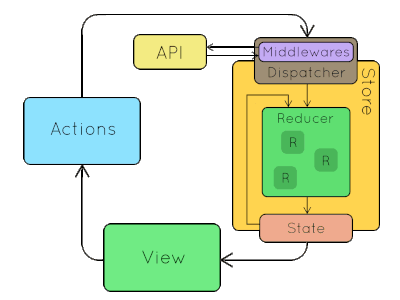

# Learn Redux Thunk by Building Netflix.


> Click :star: if you like the project. Pull Requests are highly appreciated :heart:

I'm Hiep. I work as a full-time software engineer. Most of my open-source projects are focused on one thing - to help people learn 📚. 

The repository helps you learn Redux Thunk by buiding Netflix. It means that you are learning Redux Thunk by building a real-life project. I will explain concepts in details. This post is the third part in my series and it is suitable for beginners.

My post is about __Learn React & Redux Thunk By Building Netflix__ on Dev.to: https://dev.to/hieptl/learn-react-redux-thunk-by-building-netflix-4e3j

> If you feel the repository is useful, please help me share the post and give me a Github :star:. It will make me feel motivation to work even harder. I will try to make many open sources and share to the community.
>

## __Preface__

This course will help you to learn Redux Thunk by building Netflix. It means that you are learning by doing a real-life project.

## __Table of Contents__
| No. | Topics |
| --- | --------- |
|0  | [How to Run the Project.](#how-to-run-the-project) |
|1  | [Live Demo.](#live-demo) |
|2  | [Introduction about the Creator.](#introduction-about-the-creator) |
|2.1  | [&nbsp;&nbsp;&nbsp;&nbsp;&nbsp;&nbsp;Greenwich University.](#greenwich-university) |
|2.2  | [&nbsp;&nbsp;&nbsp;&nbsp;&nbsp;&nbsp;Hitachi Vantara Vietnam.](#hitachi-vantara-vietnam) |
|3  | [Prequisites.](#prequisites) |
|3.1  | [&nbsp;&nbsp;&nbsp;&nbsp;&nbsp;&nbsp;Softwares.](#softwares) |
|3.2  | [&nbsp;&nbsp;&nbsp;&nbsp;&nbsp;&nbsp;Technical Skills.](#technical-skills) |
|3.3  | [&nbsp;&nbsp;&nbsp;&nbsp;&nbsp;&nbsp;Materials.](#materials) |
|4  | [Purposes of the Course.](#purposes-of-the-course) |
|4.1  | [&nbsp;&nbsp;&nbsp;&nbsp;&nbsp;&nbsp;Final Project.](#final-project) |
|4.2  | [&nbsp;&nbsp;&nbsp;&nbsp;&nbsp;&nbsp;Job.](#job) |
|5  | [Redux Middeware.](#redux-middleware) |
|5.1  | [&nbsp;&nbsp;&nbsp;&nbsp;&nbsp;&nbsp;What.](#what) |
|5.2  | [&nbsp;&nbsp;&nbsp;&nbsp;&nbsp;&nbsp;Why.](#why) |
|5.3  | [&nbsp;&nbsp;&nbsp;&nbsp;&nbsp;&nbsp;How.](#how) |
|5.4  | [&nbsp;&nbsp;&nbsp;&nbsp;&nbsp;&nbsp;When.](#when) |
|6  | [Redux Thunk.](#redux-thunk) |
|6.1  | [&nbsp;&nbsp;&nbsp;&nbsp;&nbsp;&nbsp;What is Thunk Function.](#what-is-thunk-function) |
|6.2  | [&nbsp;&nbsp;&nbsp;&nbsp;&nbsp;&nbsp;What is Redux Thunk.](#what-is-redux-thunk) |
|6.3  | [&nbsp;&nbsp;&nbsp;&nbsp;&nbsp;&nbsp;Differences between Redux Thunk and Redux Saga.](#differences-between-redux-thunk-and-redux-saga) |
|7  | [Apply Redux Thunk to Netflix.](#apply-redux-thunk-to-netflix) |
|8  | [Conclusion.](#conclusion) |
|9  | [References.](#references) |

## __Table of Images.__
| No. | Topics |
| --- | --------- |
|1  | [Figure 1: Redux Middleware.](#figure1) |
|2  | [Figure 2: Apply Redux Thunk to Netflix.](#figure2) |

<a id="how-to-run-the-project"></a>
## __0. How to Run the Project.__

- Step 1: Clone the project by using git clone or download the zip file.

- Step 2: Open "terminal" / "cmd" / "gitbash" and change directory to "netflix-clone" and run "npm install" to install dependencies.

- Step 3: Run "npm start" to run the fron-end project.

<a id="live-demo"></a>
## __1. Live Demo.__

- https://71cv0.csb.app/

<a id="introduction-about-the-creator"></a>
## __2. Introduction about the Creator.__

<a id="greenwich-university"></a>
### __2.1. Greenwich University.__

- Valedictorian.

- GPA 4.0 / 4.0.

- Machine Learning paper - Recommendation System - IEEE/ICACT2020.

- Co-Founder / Mentor IT club.

<a id="hitachi-vantara-vietnam"></a>
### __2.2. Hitachi Vantara Vietnam.__

- Employee of the year.

- Second prize - innovation contest.

- Techlead - HN branch.

- One of CoE Leaders (Center of Excellence).

<a id="prequisites"></a>
## __3. Prequisites.__

<a id="softwares"></a>
### __3.1. Softwares.__

- Install NodeJS.

- An IDE or a text editor (VSCode, Intellij, Webstorm, etc).

<a id="technical-skills"></a>
### __3.2. Technical Skills.__

- Basic programming skill.

- Basic HTML, CSS, JS skills.

- Basic React skill. (If you want to learn about React, you can refer __Learn React by Building Netflix__: https://dev.to/hieptl/learn-react-by-building-netflix-1127).

- Basic Redux skill. (If you want to learn about Redux, you can refer __Learn React & Redux by Building Netflix__: https://dev.to/hieptl/learn-react-redux-by-building-netflix-bd5).

<a id="materials"></a>
### __3.3. Materials.__

- Html, css, js (source code) was prepared because I want to focus on React and share knowledge about React. Building html and css from scratch would take a lot of time.

- README.md (the md file will contain everything about the course).

- Netflix data will be used to import to Firebase. In this course, we use Firebase as our back-end service.

<a id="purposes-of-the-course"></a>
## __4. Purposes of the Course.__

<a id="final-project"></a>
### __4.1. Final Project.__

- The course would help you have understanding about React and Redux Thunk.

- You could build the final project with end-to-end solution (front-end solution using React and back-end solution using Firebase).

<a id="job"></a>
### __4.2. Job.__

- After finishing the course, you could get a job with fresher / junior position.

<a id="redux-middleware"></a>
## __5. Redux Middleware.__

<a id="figure1"></a>


Figure 1. Redux Middleware.

<a id="what"></a>
### __5.1 What.__

- Redux middleware provides a third-party extension point between dispatching an action, and the moment it reaches the reducer. People use Redux middleware for logging, crash reporting, talking to an asynchronous API, routing, and more.

<a id="why"></a>
### __5.2 Why.__

-  Redux middleware were designed to enable writing logic that has side effects.

- Middleware like Redux Thunk or Redux Promise just gives you “syntax sugar” for dispatching thunks or promises

<a id="how"></a>
### __5.3 How.__

- In order to use Redux Middleware in your application, you need to import and use __applyMiddleware__ function from redux. It will help you to apply midllewares in your application.

<a id="when"></a>
### __5.4 When.__

- Redux middleware is suitbale for medium or large applications. 

- It help you to separate the business code and the view. 

- Redux middleware were designed to enable writing logic that has side effects. As what mentioned, a Redux middleware can do anything when it sees a dispatched action: log something, modify the action, delay the action, make an async call, and more. Also, since middleware form a pipeline around the real store.

<a id="redux-thunk"></a>
## __6. Redux Thunk.__

<a id="what-is-thunk-function"></a>
### __6.1. What is Thunk Function.__

- A thunk is just a function which delays the evaluation of the value. It doesn’t take any arguments but gives the value whenever you invoke the thunk. i.e, It is used not to execute now but it will be sometime in the future. Let's take a synchronous example,

```js
const add = (x,y) => x + y;

const thunk = () => add(2,3);

thunk() // 5
```

<a id="what-is-redux-thunk"></a>
### __6.2. What is Redux Thunk.__

- Redux Thunk middleware allows you to write action creators that return a function instead of an action. The thunk can be used to delay the dispatch of an action, or to dispatch only if a certain condition is met. The inner function receives the store methods dispatch and getState as parameters.

- With a plain basic Redux store, you can only do simple synchronous updates by dispatching an action. Middleware extends the store's abilities, and lets you write async logic that interacts with the store.

- Thunks are the recommended middleware for basic Redux side effects logic, including complex synchronous logic that needs access to the store, and simple async logic like AJAX requests.

<a id="differences-between-redux-thunk-and-redux-saga"></a>
### __6.3. Differences between Redux Thunk and Redux Saga.__

|| Redux Thunk | Redux Saga |
|:---|:---|:---|
| Advantages|Simple, strong, easy to use, it is suitable for beginners|It is suitable for large scale applications. It helps us to write cleaner code and test the code easier when comparing with Redux Thunk|
| Disadvantages|It is suitable for small applications.|There is a learning curve for beginners and it is not suitable for small applications.|

<a id="apply-redux-thunk-to-netflix"></a>
## __7. Apply Redux Thunk to Netflix.__

<a id="figure2"></a>


Figure 2. Apply Redux Thunk to Netflix.

It is time to understand how Redux Thunk works by applying it to our Netflix application. In the first part of this series, we built the login function. However, we just wrote a function to call Firebase authentication service when clicking on "Sign In" button. It is time to change the code by using Redux-Thunk. 

- Step 1: We need to install __redux-thunk__ by running npm install redux-thunk.

- Step 2: Update __store.js__ file with the following code.

```js
// import create store.
import { createStore, applyMiddleware } from "@reduxjs/toolkit";
// import root reducer.
import rootReducer from "./reducers";
// import thunk
import thunk from "redux-thunk";

export default createStore(rootReducer, applyMiddleware(thunk));
```

> 1st NOTE:
>
> - We import __thunk__ from __redux-thunk__. 
>
> - As mentioned above, in order to apply redux middleare in our application, we need to use __applyMiddleware__. In this case, it accepts __thunk__ as the first parameter.

- Step 3: We need to create __services__ folder, this folder is used to store services in the application. Services will take responsibility to interact with back-end services.

- Step 4: We are building the login feature. Therefore, we need to create __AuthService.js__ file in __services__ folder. This file will interact with back-end services which are related to auth functions. 

```js
// import firebase auth.
import { firebaseAuth } from "../firebase/firebase";

export const login = async ({ email, password }) => {
  try {
    return await firebaseAuth.signInWithEmailAndPassword(email, password);
  } catch (error) {
    console.log(error);
  }
};
```

> 2nd NOTE: 
>
> - We need to call Firebase authentication service. That's why __firebaseAuth__ will be imported. 
>
> - __login__ function accept __email__, __password__ as parameters. It will be used in the following section.
>
> - It is time to create a login action (redux action). The login action will be dispatched when clicking "Sign In" button.
>

- Step 5: Create __AuthActions.js__ in __actions__ folder.

```js
// import auth service.
import * as authService from "../services/AuthService";
// import action types.
import * as loadingActionTypes from "../actions/LoadingActions";

export const login = ({ email, password }) => async (dispatch) => {
  try {
    dispatch({ type: loadingActionTypes.SHOW_LOADING });
    const userCredentials = await authService.login({ email, password });
    if (userCredentials) {
      console.log(userCredentials);
    }
    dispatch({ type: loadingActionTypes.HIDE_LOADING });
  } catch (error) {
    console.log(error);
  }
};
```

> 3rd NOTE:
>
> - In __AuthActions.js__ file, we create a thunk function which is called __login__. 
>
> - In some cases, we need to dispatch other actions inside the current action. Therefore,  __dispatch__ is used to achieve that. 
>
> - We are dispatching actions to show __Loading__ component before calling Firebase authentication service and hide it after calling the service.
> 

- Step 6: Replace __LoginForm.js__ file with the following code. 

```js
/**
 * Github: https://github.com/hieptl/netflix-clone.
 * Dev.to: https://dev.to/hieptl/learn-react-by-building-netflix-1127
 */
// import react.
import { useState } from "react";
// import useDispatch to dispatch action to the store.
import { useDispatch } from "react-redux";
// import actions.
import * as authActions from "../../actions/AuthActions";

/**
 * create LoginForm component.
 */
function LoginForm() {
  // create email and password state to store user's credentials.
  const [email, setEmail] = useState();
  const [password, setPassword] = useState();

  const dispatch = useDispatch();

  /**
   * handle event when the user clicks on "Login" button.
   */
  const login = () => {
    dispatch(authActions.login({ email, password }));
  };

  /**
   * update email state when the user inputs the email field.
   * @param {*} e - synthetic event to get the latest email's value.
   */
  const onEmailChanged = (e) => {
    // get email value.
    const updatedEmail = e.target.value;
    // update email state.
    setEmail(() => updatedEmail);
  };

  /**
   * update password state when the user input the password field.
   * @param {*} e - synthetic event to get the latest password's value.
   */
  const onPasswordChanged = (e) => {
    // get password value.
    const updatedPassword = e.target.value;
    // update password state.
    setPassword(() => updatedPassword);
  };

  return (
    <div className="login-body">
      <div className="login-body__form">
        <h1>Sign In</h1>
        <div className="login-body__input mb-16">
          <input
            type="text"
            placeholder="Email or phone number"
            onChange={onEmailChanged}
          />
        </div>
        <div className="login-body__input">
          <input
            type="password"
            placeholder="Password"
            onChange={onPasswordChanged}
          />
        </div>
        <button className="login-body__submit-btn" onClick={login}>
          Sign In
        </button>
        <div className="login-body__options">
          <span>Remember me</span>
          <span className="login-body__need-help">Need help?</span>
        </div>
        <div className="login-body__footer">
          <div className="login-body__fb">
            
            <span>Login with Facebook</span>
          </div>
          <div className="login-body__new-to-nl">
            <span>New to Netflix ?</span>
            <span className="login-body__sign-up">Sign up now.</span>
          </div>
          <div className="login-body__google_captcha">
            This page is protected by Google reCAPTCHA to ensure you're not a
            bot.
            <span className="login-body__learn-more">Learn more.</span>
          </div>
        </div>
      </div>
    </div>
  );
}
// export LoginForm component.
export default LoginForm;

```

> FINAL NOTE:
>
> - We import __useDispatch__ to dispatch redux actions. 
>
> - We also import __AuthActions__ and call the login action with the following code:
>
> ```js
> dispatch(authActions.login({ email, password }));
> ```

<a id="conclusion"></a>
## __Conclusion__

In this course, we have learn about Redux Thunk by building Netflix. I hope that you can apply Redux to your projects. If you feel the projects is useful, please help me share it to the community and give me Github :star:

<a id="references"></a>
## __References__

[1]. https://redux.js.org/ \
[2]. https://github.com/reduxjs/redux-thunk

